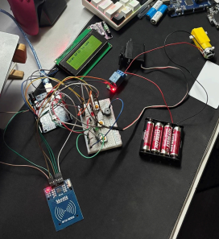
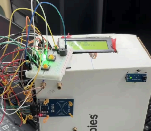

# RFID-Controlled Smart Washing Machine

<!-- Layout -->
## Machine Layout
<p align="center">
  
</p>

<!-- Wiring -->
## Wiring Diagram
<p align="center">
  
</p>

<!-- Setup -->
## Prototype Setup
<p align="center">
  
</p>

## Abstract
This project is a fully functional Arduino-based smart washing machine prototype. It integrates motion detection, RFID authentication, user-set wash/spin times, motor control, and real-time temperature monitoring.

## Features
- Motion detection with IR sensor to greet users
- RFID authentication for secure access
- Customizable washing and spinning durations using buttons
- LCD display for instructions and real-time temperature monitoring
- Wash and spin motors controlled via relays
- Servo-controlled door lock
- Buzzer notification at cycle completion

## Materials and Equipment
- Arduino Uno
- Jumper wires
- RFID Reader (MFRC522)
- DHT11 Temperature Sensor
- IR Sensor (PIR)
- DC Motors (wash & spin)
- Servo Motor
- LCD (I2C)
- Push Buttons
- LEDs
- Batteries (Double-A)
- Buzzer

## Methodology
1. Motion Detection: IR sensor triggers welcome message
2. RFID Authentication: Access granted only for authorized UID
3. Time Selection: Users set wash and spin durations via buttons
4. Cycle Execution: Wash and spin motors controlled via relays; DHT11 shows temperature
5. Completion: Buzzer plays melody, door unlocks, system resets

## Code
Arduino IDE compatible. Full code included in this repo.

```cpp
#include <Wire.h>
#include <LiquidCrystal_I2C.h>
#include <SPI.h>
#include <MFRC522.h>
#include <Servo.h>
#include <DHT.h>

// [Truncated: full code available in repo]

```markdown
## Results & Discussion
- RFID authenticated users successfully
- LCD guided cycle selection
- Motors, relays, and servo worked as intended
- DHT11 provided temperature feedback
- Buzzer and door lock improved user experience

## Conclusion
The smart washing machine prototype was successfully implemented with all objectives met: secure authentication, user-configurable cycles, interactive feedback, and coordinated motor/servo operation.

## Recommendations
- Add music player or video display
- Advanced water level control
- Remote control via smartphone

## References
- MFRC522 RFID with Arduino: https://randomnerdtutorials.com/security-access-using-mfrc522-rfid-reader-with-arduino/
- I2C LCD with Arduino: https://howtomechatronics.com/tutorials/arduino/arduino-lcd-tutorial/
- DHT11 Arduino Tutorial: https://arduinogetstarted.com/tutorials/arduino-dht11

## Acknowledgement
Thanks to Dr. Zulkifli Bin Zainal Abidin and Dr. Wahju Sediono for guidance in the Mechatronics System Integration course.


