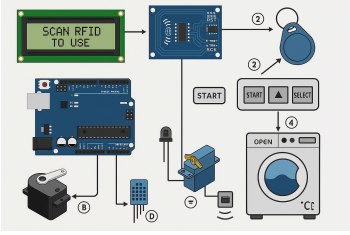

# RFID-Controlled Smart Washing Machine

## Machine Layout
<p align="center">
  
</p>

## Wiring Diagram
<p align="center">
  
</p>

## Prototype Setup
<p align="center">
  
</p>

## Abstract
This project is a fully functional Arduino-based smart washing machine prototype. It integrates motion detection, RFID authentication, user-set wash/spin times, motor control, and real-time temperature monitoring.

## Extended Description
The aim of this project was to build a functional smart washing machine system incorporating multiple aspects of Mechatronics System Integration. Traditional washing machines simply wash clothes, but modern ones include features such as automatic drying, selectable water levels, temperature control, and even cashless operation in public machines. 

This prototype replicates several of these functionalities:
- Motion detection to greet users as they approach
- RFID authentication for secure access
- User-selectable wash and spin durations via push buttons
- Real-time temperature display using DHT11 sensor
- Automated wash and spin cycles controlled via relays
- Servo-controlled door lock to enhance safety
- Buzzer alerts to notify cycle completion

The system was implemented on an Arduino Uno with multiple sensors and actuators working in harmony. The project demonstrates how embedded systems, sensor integration, and actuator control can combine to create a functional and interactive home appliance prototype.

## Features
- Motion detection with IR sensor to greet users
- RFID authentication for secure access
- Customizable washing and spinning durations using buttons
- LCD display for instructions and real-time temperature monitoring
- Wash and spin motors controlled via relays
- Servo-controlled door lock
- Buzzer notification at cycle completion

## Materials and Equipment
- Arduino Uno
- Jumper wires
- RFID Reader (MFRC522)
- DHT11 Temperature Sensor
- IR Sensor (PIR)
- DC Motors (wash & spin)
- Servo Motor
- LCD (I2C)
- Push Buttons
- LEDs
- Batteries (Double-A)
- Buzzer

## Methodology
1. Motion Detection: IR sensor triggers welcome message
2. RFID Authentication: Access granted only for authorized UID
3. Time Selection: Users set wash and spin durations via buttons
4. Cycle Execution: Wash and spin motors controlled via relays; DHT11 shows temperature
5. Completion: Buzzer plays melody, door unlocks, system resets

## Code
Arduino IDE compatible. Full code included in this repo.

```cpp
#include <Wire.h>
#include <LiquidCrystal_I2C.h>
#include <SPI.h>
#include <MFRC522.h>
#include <Servo.h>
#include <DHT.h>

// [Truncated: full code in repo]

## References
- MFRC522 RFID with Arduino: https://randomnerdtutorials.com/security-access-using-mfrc522-rfid-reader-with-arduino/
- I2C LCD with Arduino: https://howtomechatronics.com/tutorials/arduino/arduino-lcd-tutorial/
- DHT11 Arduino Tutorial: https://arduinogetstarted.com/tutorials/arduino-dht11

## Acknowledgement
Thanks to Dr. Zulkifli Bin Zainal Abidin and Dr. Wahju Sediono for guidance in the Mechatronics System Integration course.


